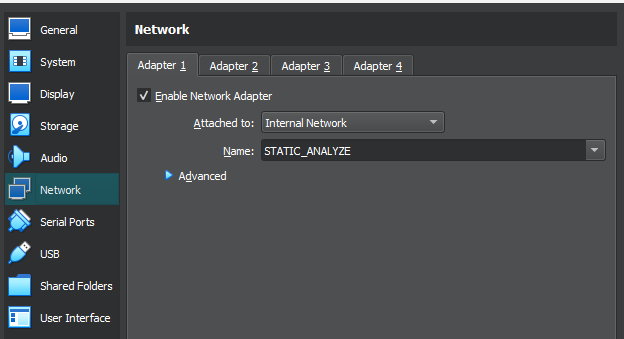
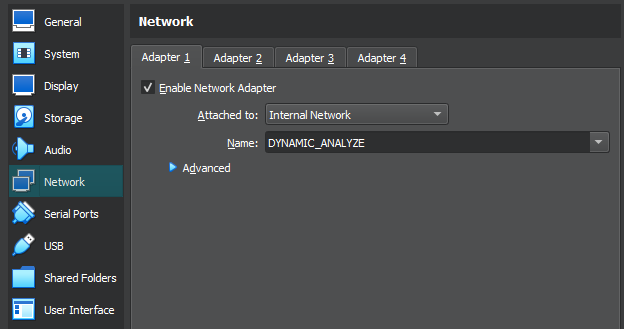

# Vagrant Forensics-Reverse-VM's  
## OVA Format  
Can possible to download directly the 4 forensics machines  
https://drive.sukudir.com/drive/s/4fIEV0tiIaLDk7pFIE7MG02KcGxyvm  

## Installation of a Forensics-Reverse-VM in VM format using vagrant  

### Prerequisites  
1. Installation of Vagrant and git  
arch
```
pacman -S vagrant git -y
```  
Debian / ubuntu  
```
apt install vagrant git -y
```  

2. Cloning this repository  
```
git clone https://github.com/Oni-kuki
```
### Starting  
1. Starting, it has to be done machine by machine  
```
vagrant up pfsense
vagrant up Remnux
vagrant up Sift
vagrant up flare
```
  
> [!TIP]
> When the machine is started and you see this message in the vagrant logs for setting up the forensics machines, press ctrl+c to try to stop ssh connection attempts because I have basically cut this option in the machines directly, especially for flareVM and pfsense, for sift and Remnux too, but if you build the machines directly with the vagrantfile in the [Construction](./Construction/) folder it will be activated.  

> [!TIP]
> When the machines are started up with the vagrant command, and you have retrieved all your parts to be analysed, you will need to modify the configuration of the network cards, because at the beginning the machines are connected in NAT to allow you to retrieve what you need, however once you want to start your analysis you will only need to change the network of your machine to pass through the pfsense and limit the network for some and cut for others, in particular the windows (in the case where you will be doing dynamic analysis).  
> Stop Machines and Changed the network configuration like that:

* SIFT and REMNUX  
  


* FLARE  


> [!CAUTION]
> You do not need to touch the pfsense network normally but if you want to be reassured you can stop the NAT connection.  

## Explciation of VM's  
1. PfSense  
I have configured three private networks, "natnet," "STATIC_ANALYZE," and "DYNAMIC_ANALYZE," and disables the default synced folder. There are also commented-out provisions for Ansible, file transfer, and shell commands that you can uncomment and customize if needed.  
> By default the VM configuration:  
> vb.memory = "1024"  
> vb.cpus = "2"  

> For remnux or sift, you can only choose one, because both machines basically have the same objective.  

2. Remnux VM  
I have set up a private network named "STATIC_ANALYZE" (same network of pfsense) and disables the default synced folder. There are also commented-out provisions for shell commands and Ansible playbook that you can uncomment and customize.  
> By default the VM configuration:  
> vb.memory = "4096"  
> vb.cpus = "2"  


3. Sift VM  
I have set up a private network named "STATIC_ANALYZE" and disables the default synced folder. There are commented-out provisions for shell commands and Ansible playbook that you can uncomment and customize.  
> By default the VM configuration:  
> vb.memory = "4096"  
> vb.cpus = "2"  

4. Flare VM custom  
I have set up a private network named "DYNAMIC_ANALYZE" and disables the default synced folder. There is a commented-out provision for an Ansible playbook that you can uncomment and customize.  
> by default the vm:  
> vb.memory = "6045"  
> vb.cpus = "2"
